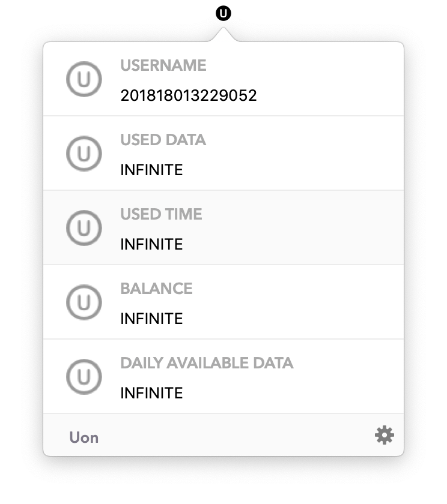

# Uon for Mac:

> Elegant network client for [UCAS](http://www.ucas.edu.cn)

## Screenshots

## Downloads

- [0.1.0 beta](https://github.com/Chriskuei/Uon-for-Mac/releases/download/v0.1.0/Uon.app.zip)

## Features

- [x] Login & Logout

## Requirements

- Swift 5+
- Xcode 10.2.1+
- macOS 10.14+

## FAQ

### What's the origin of the name Uon?

The project is derived from [Bon-for-Mac](https://github.com/Chriskuei/Bon-for-Mac/). Uon stands for UCAS Online, a elegant network client for UCAS. iOS version is [here](https://github.com/Chriskuei/Uoner/).

---

## Acknowledgements

- [Alamofire](https://github.com/Alamofire/Alamofire)
- [Gank-for-Mac](https://github.com/hujiaweibujidao/Gank-for-Mac)

## Contribution

- If you need help or you'd like to ask a general question, open an issue.
- If you found a bug, open an issue.
- If you have a feature request, open an issue.
- If you want to contribute, submit a pull request.

## Credits

Uon is owned and maintained by [Chriskuei](http://github.com/chriskuei).

## License

Uon is released under the MIT license. See [LICENSE](LICENSE) for details.
